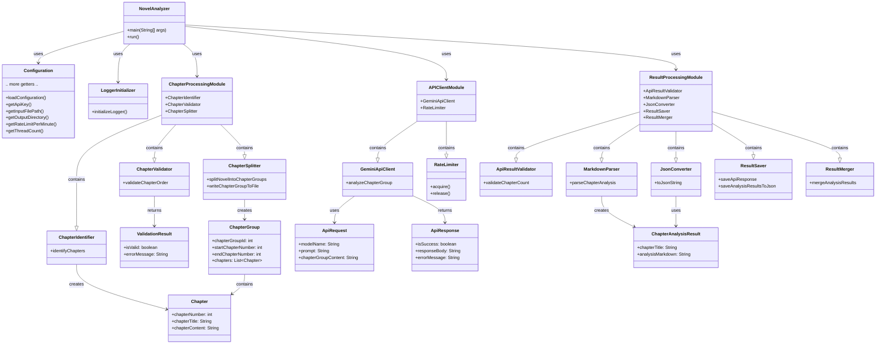

```mermaid
classDiagram
    class NovelAnalyzer {
        +main(String[] args)
        +run()
    }
    class Configuration {
        +loadConfiguration()
        +getApiKey()
        +getInputFilePath()
        +getOutputDirectory()
        +getRateLimitPerMinute()
        +getThreadCount()
        .. more getters ..
    }
    class LoggerInitializer {
        +initializeLogger()
    }
    class ChapterProcessingModule {
        +ChapterIdentifier
        +ChapterValidator 
        +ChapterSplitter 
    }
    class APIClientModule {
        +GeminiApiClient
        +RateLimiter
    }
    class ResultProcessingModule {
        +ApiResultValidator
        +MarkdownParser
        +JsonConverter
        +ResultSaver
        +ResultMerger
    }
    class ChapterIdentifier {
        +identifyChapters
    }
    class ChapterValidator {
        +validateChapterOrder
    }
    class ChapterSplitter {
        +splitNovelIntoChapterGroups
        +writeChapterGroupToFile
    }
    class GeminiApiClient {
        +analyzeChapterGroup
    }
    class RateLimiter {
        +acquire()
        +release()
    }
    class ApiResultValidator {
        +validateChapterCount
    }
    class MarkdownParser {
        +parseChapterAnalysis
    }
    class JsonConverter {
        +toJsonString
    }
    class ResultSaver {
        +saveApiResponse
        +saveAnalysisResultsToJson
    }
    class ResultMerger {
        +mergeAnalysisResults
    }
    class Chapter {
        +chapterNumber: int
        +chapterTitle: String
        +chapterContent: String
    }
    class ChapterGroup {
        +chapterGroupId: int
        +startChapterNumber: int
        +endChapterNumber: int
        +chapters: List~Chapter~
    }
    class ValidationResult {
        +isValid: boolean
        +errorMessage: String
    }
    class ApiRequest {
        +modelName: String
        +prompt: String
        +chapterGroupContent: String
    }
    class ApiResponse {
        +isSuccess: boolean
        +responseBody: String
        +errorMessage: String
    }
    class ChapterAnalysisResult {
        +chapterTitle: String
        +analysisMarkdown: String
    }

    NovelAnalyzer --> Configuration : uses
    NovelAnalyzer --> LoggerInitializer : uses
    NovelAnalyzer --> ChapterProcessingModule : uses
    NovelAnalyzer --> APIClientModule : uses
    NovelAnalyzer --> ResultProcessingModule : uses
    ChapterProcessingModule --|> ChapterIdentifier : contains
    ChapterProcessingModule --|> ChapterValidator : contains
    ChapterProcessingModule --|> ChapterSplitter : contains
    APIClientModule --|> GeminiApiClient : contains
    APIClientModule --|> RateLimiter : contains
    ResultProcessingModule --|> ApiResultValidator : contains
    ResultProcessingModule --|> MarkdownParser : contains
    ResultProcessingModule --|> JsonConverter : contains
    ResultProcessingModule --|> ResultSaver : contains
    ResultProcessingModule --|> ResultMerger : contains
    ChapterSplitter --> ChapterGroup : creates
    ChapterIdentifier --> Chapter : creates
    ChapterValidator --> ValidationResult : returns
    GeminiApiClient --> ApiRequest : uses
    GeminiApiClient --> ApiResponse : returns
    MarkdownParser --> ChapterAnalysisResult : creates
    JsonConverter --> ChapterAnalysisResult : uses
    ChapterGroup --> Chapter : contains
```